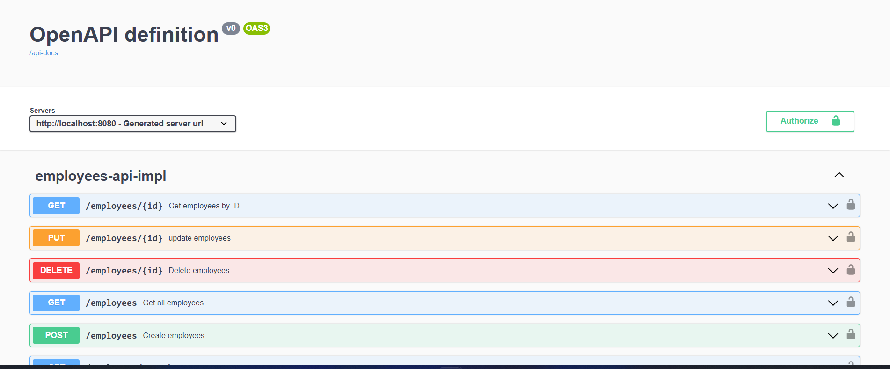

# Objetivo
Desarrollar un servicio backend resiliente, seguro y escalable que gestione operaciones sobre una entidad de "Empleado", siguiendo prácticas modernas de desarrollo, arquitectura de microservicios y aplicando los principios de DevSecOps

# Requisitos previos 
- Java 11 o Java 17
- Docker

# Ejecutar servidor de base de datos 
ejecutamos el siguiente comando para construir la imagen de MySQL:
```bash
   docker build -f mysql.dockerfile .
```
luego ejecutar el contenedor:
```bash
  docker run -d -p 3306:3306 --name mysql-db mysql
```

# Levantar el servicio de empleados
```bash
  docker build -f employees.dockerfile -t employees-api .
```

```bash
  docker run -p 8080:8080 employees-api 
```

# Swagger UI
Una vez que el servicio esté en ejecución, puedes acceder a la documentación de la API utilizando Swagger
http://localhost:8080/swagger-ui/index.html




